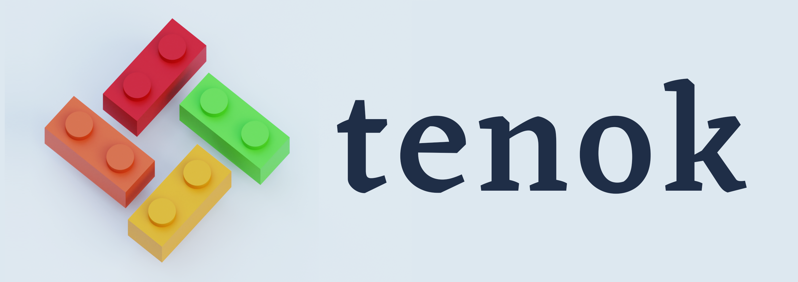

Tenok
=====

The [Tenok project](https://github.com/shengwen-tw/tenok) is a real-time operating system (RTOS) designed for robotic applications and the
Internet of Things (IoT). The name originated from the language of an indigenous tribe called Amis in Taiwan, where "tenok" means
"kernel" in their language. It resembles various designs from Linux and maintains a small code footprint for ARM Cortex-M processors. In
contrast to NuttX, Tenok does not implement a set of low-level hardware drivers as a part of the system. Instead, it adopts an approach
similar to FreeRTOS by treating the RTOS as a third-party library. Users can choose their preferred library for the hardware abstraction
layer (HAL).

Tenok also integrates the MAVLink communication protocol and provides several utilities for robotics, including a debug visualization tool 
and a facility tool for supporting software-in-the-loop simulation with the Gazebo simulator.

## Key Features

* POSIX compliant RTOS
* Linux-like designs: Wait queue, kthread, tasklet, kfifo, printk, and more
* Task and Thread (Task resembles UNIX process as a group of threads)
* Synchronization: Mutex (supports priority inheritance), Semaphore, and Spinlock
* Inter-Process Communication (IPC): FIFO (Named pipe), Message Queue, and Signals
* Kernel-space memory allocation: Buddy system and Slab allocator
* User-space memory allocation: Dynamic allocation (First-Fit Free List) and Memory pool
* Software timer and clock
* Built-in Shell with command completion and history saving
* Root and ROM file systems
* Real-time plotting and customizable debug messaging with a metalanguage
* Integrated with MAVLink communication protocol
* Software-in-the-loop (SIL) simulation with the Gazebo simulator

## Tools

* **mkromfs**: Import files to the firmware binary with `Tenok`'s romfs format
* **msggen**: Convert user-defined metalanguage messages into C codes and YAML files
* **rtplot**: For on-board data real-time plotting, where the message definitions are loaded from the auto-generated YAML files
* **gazebo_bridge**: Message forwarding between `Tenok` (serial) and Gazebo simulator (TCP/IP)

## Benchmarking

`Tenok` currently supports [Dhrystone](https://en.wikipedia.org/wiki/Dhrystone) and [CoreMark](https://www.eembc.org/coremark/) for basic benchmarking. Please refer to [benchmarks.mk](https://github.com/shengwen-tw/tenok/blob/master/user/benchmarks/benchmarks.mk) for details.

## Getting Started

* [Developement Tools Setup](https://tenok-rtos.github.io/md_docs_1_environment_setup.html)
* [Build and Run the Tenok](https://tenok-rtos.github.io/md_docs_2_build_and_run.html)
* [Interact with Tenok Shell](https://tenok-rtos.github.io/md_docs_3_shell.html)
* [Run Tenok with Gazebo Simulator](https://tenok-rtos.github.io/md_docs_4_gazebo.html)
* [Real-time Visualization with rtplot and debug-link](https://tenok-rtos.github.io/md_docs_5_debug_link.html)

## Resources 

* [Tenok API List](https://tenok-rtos.github.io/md_docs_6_api_list.html)
* [Supported Platforms](https://tenok-rtos.github.io/md_docs_7_platforms.html)
* [Doxygen Page](https://tenok-rtos.github.io/index.html)

## License

`Tenok` is released under the BSD 2-Clause License. For detailed information please read the [LICENSE](https://github.com/shengwen-tw/neo-rtenv/blob/master/LICENSE).

## Related Projects

`Tenok` is heavily influenced by the following projects during its development:

1. [rtenv](https://github.com/embedded2014/rtenv) / [rtenv+](https://github.com/embedded2014/rtenv-plus)
2. [mini-arm-os](https://github.com/jserv/mini-arm-os)
3. [Piko/RT](https://github.com/PikoRT/pikoRT)
4. [linenoise](https://github.com/antirez/linenoise)
